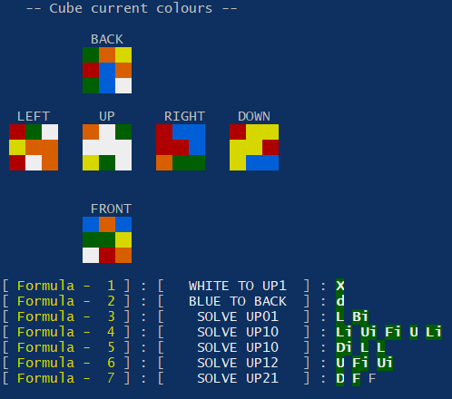

# rubiks_cube_formulae_generator
Rubik's cube solving formula generator algorithm.

For a 3x3 shuffled Rubik's cube when all 6 sides snapshots are given, this algorithm will generate list of formulae in order to perform for solving the rubik's cube.

Sample Output of C version

	